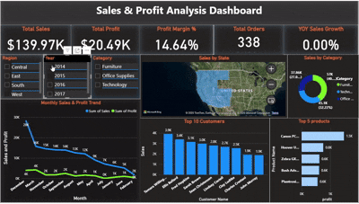
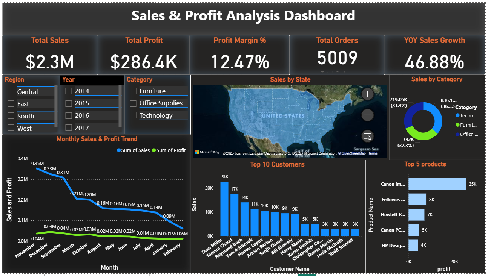
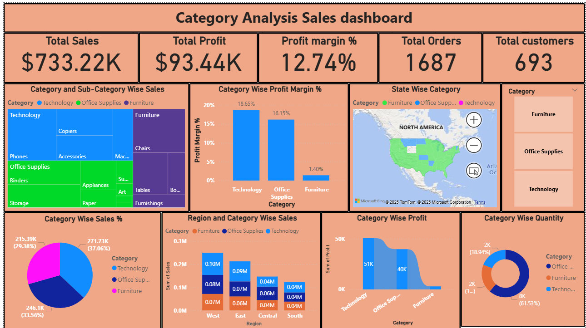

# 📊 Power BI Dashboards – Sales & Category Analysis                                                          

## 🔹 Project Overview  
This repository contains **interactive Power BI dashboards** designed to analyze business performance.  
The dashboards showcase **sales, profit, category trends, and customer insights** with advanced visuals and KPIs.  

These dashboards help stakeholders track **growth, profitability, and category-wise contributions** for data-driven decision-making.  

### 🔹 Quick Preview:  
  
---

### 1️⃣ Sales & Profit Analysis Dashboard  
**Key Features:**  
- Total Sales, Profit, Orders, Customers 
- YoY Sales Growth (%)  
- Region & Year-wise filters 
- Monthly Sales & Profit Trend 
- Top 10 Customers by Sales  
- Top 5 Products by Profit  
- Sales distribution by Category  

📷 *Preview:*  
  

---

### 2️⃣ Category Analysis Sales Dashboard  
**Key Features:**  
- Total Sales, Profit, Profit Margin %  
- Category & Sub-Category Sales 
- Category-wise Profit Margin 
- State-wise Sales by Category  
- Category Sales % Contribution  
- Region & Category-wise Sales   

📷 *Preview:*  
  

---
## 🎯 Key Insights  
- Technology category has the **highest profit margin**.  
- Furniture contributes good sales but **very low profit margin**.  
- YoY growth is positive, with a **steady rise in orders**.  
- Top customers & products contribute significantly to overall profit.  

---
                                                                                                      
---

## 🔹 Tools & Technologies Used  
- **Power BI Desktop** – Dashboard design & DAX measures  
- **Data Source:** Sample Superstore Dataset (Sales & Orders Data)  
- **DAX Measures Used:**   

---

---

📌 **Author:** Shubham Vishwakarma  
📌 **Dataset:** Superstore Sales Dataset  
📌 **Tool:** Power BI Desktop  
